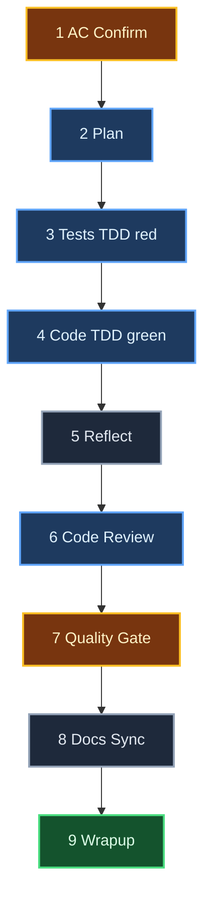
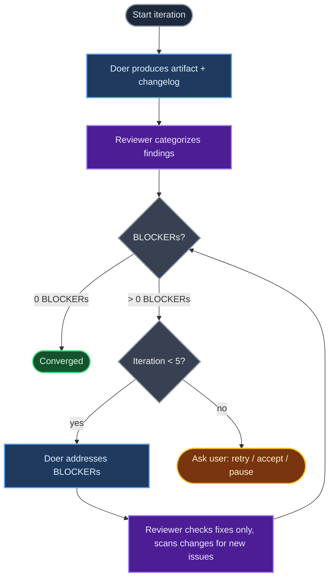
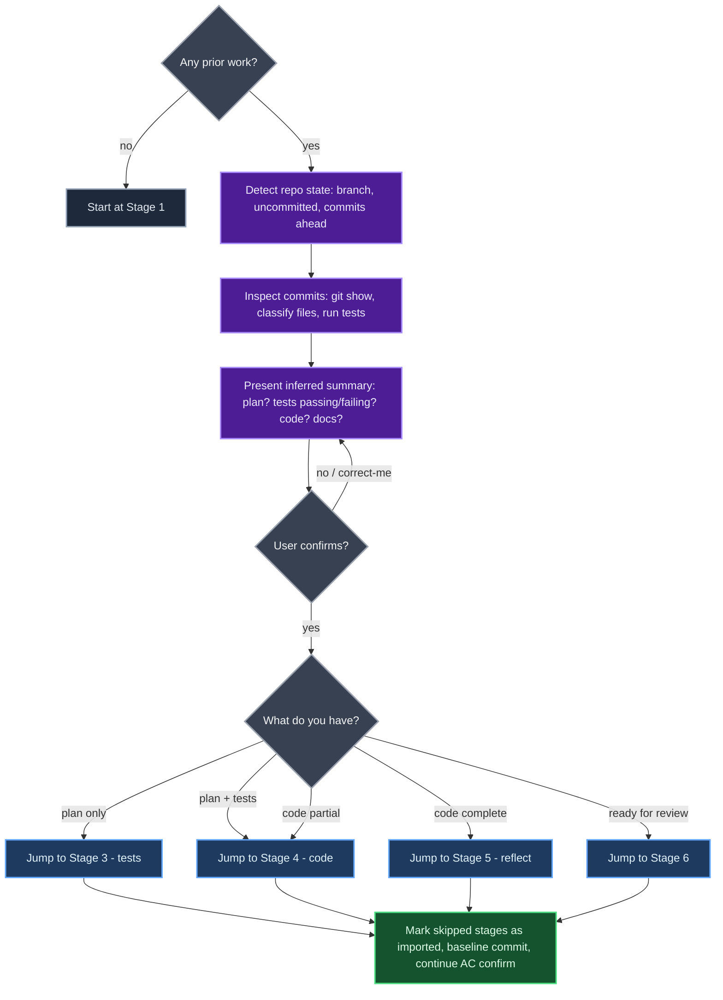

# doer

**Ticket execution orchestrator for Claude Code.**

Takes a pre-defined ticket (feature, bug, refactor) from acceptance criteria to implementation-ready code on a feature branch. Nine sequential stages, delta-aware doer/reviewer loops, narration you can pause at any moment.

Scope stops before PR and deploy.

---

## Pipeline



**Blue** = doer/reviewer loop (max 5 iterations) · **Amber** = validation gate · **Green** = wrapup (lessons captured) · **Slate** = single-pass stage

Every stage ends with a commit on the feature branch, creating a trail of evidence that later agents can read with `git diff`.

---

## Doer / Reviewer Loop

Stages 2, 3, 4, and 6 run a delta-aware convergence loop.



**Iteration 1** — reviewer is clean-slate.
**Iteration 2+** — reviewer receives prior findings + doer's changelog. Marks each prior BLOCKER as `RESOLVED` or `STILL_OPEN`. Scans only the areas the doer touched for new issues. No re-analysis of untouched parts.

Findings are categorized:
- `BLOCKER` — must fix before advancing
- `SUGGESTION` — optional, user decides
- `INFO` — observational

---

## Pre-Existing Work

If you already started on the ticket (plan, tests, code, docs), Stage 1 detects it and skips ahead. The orchestrator **reads your commits, classifies touched files, and runs the test suite** to infer where you are — not just counts commits.



---

## Installation

**One-time setup (per machine).** Clone once, symlink from every Claude config you use.

```bash
# 1. Clone the repo (one place only)
mkdir -p ~/src
git clone https://github.com/icarloscornejo/doer.git ~/src/doer

# 2. Symlink from each Claude config you use
ln -s ~/src/doer ~/.claude/skills/doer
ln -s ~/src/doer ~/.claude-work/skills/doer    # optional
ln -s ~/src/doer ~/.claude-me/skills/doer         # optional
# ...repeat for every .claude-* you have
```

**Updates:**

```bash
cd ~/src/doer && git pull
```

One pull refreshes every symlinked Claude at once.

---

## Usage

| Command | Description |
|---------|-------------|
| `/doer <TICKET-ID>` | Start a new ticket. Orchestrator asks for title, description, type, ACs, context, branch name. |
| `/doer continue <TICKET-ID>` | Resume a paused ticket from its last stage. |
| `/doer status <TICKET-ID>` | Show current stage, loop state, blockers. |
| `/doer list` | List all tickets under `./.doer/tickets/`. |
| `/doer pause` | Persist current state and stop. |

Once a ticket is active, natural language works too: "keep going", "pause here", "the plan looks good, continue". The orchestrator picks up the active ticket from `./.doer/tickets/*/metadata.json`.

**Note:** every stage must run — there is no manual stage-skip command. The only way to skip stages is via the Stage 1 pre-existing-work detection.

---

## State Layout

All state lives under `./.doer/` in the target repo:

```
./.doer/
├── knowledge/
│   ├── lessons/          # Accumulated across tickets. Read before planning.
│   └── assumptions/      # Per-ticket, validated at wrapup.
└── tickets/
    └── <TICKET-ID>/
        ├── metadata.json   # Workflow state
        ├── ticket.md       # Intake (title, description, type, context)
        ├── ac.md           # Confirmed acceptance criteria
        ├── plan.md
        ├── reflect.md
        ├── wrapup.md
        └── review/
            ├── plan-review-1.md
            ├── tests-review-1.md
            └── code-review-1.md
```

Commit `./.doer/` to the target repo if you want the knowledge base (lessons, assumptions) to travel with the code and be shared. Otherwise, add it to `.gitignore` for personal use.

---

## Design Notes

- **One branch, one ticket.** All work lands on a single feature branch. Every stage commits its artifact.
- **Orchestrator is the sole voice.** Subagents write artifacts and return JSON summaries. Only the orchestrator prompts the user.
- **Narration first.** Every action is announced before, during, and after. You can pause at any moment.
- **No hidden state.** Everything lives in `./.doer/` on disk. Context compression cannot lose progress.
- **No push, no PR, no deploy.** `/doer` stops after wrapup. You push and open the PR manually.

---

## License

MIT
