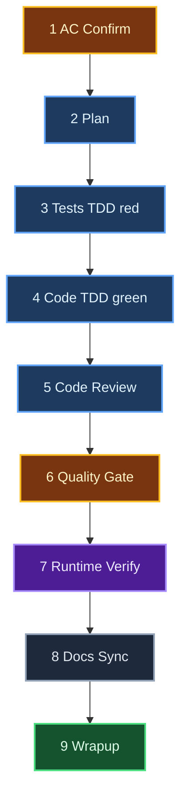
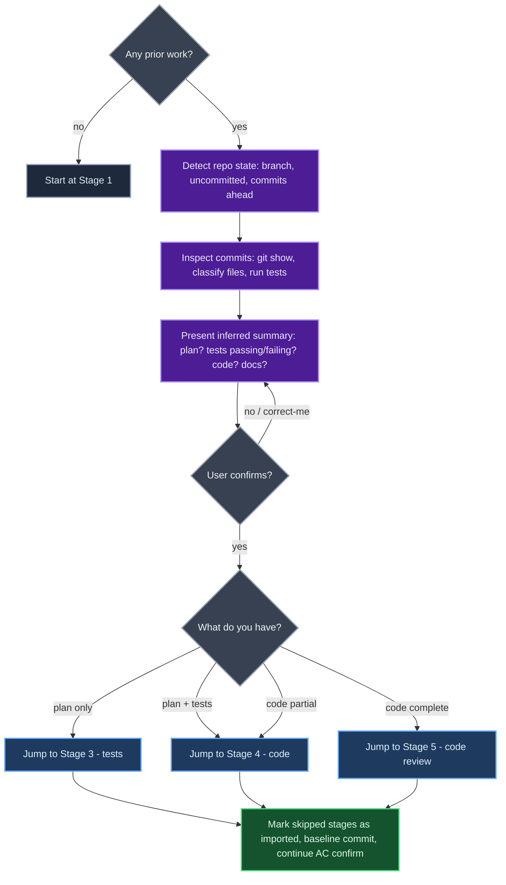
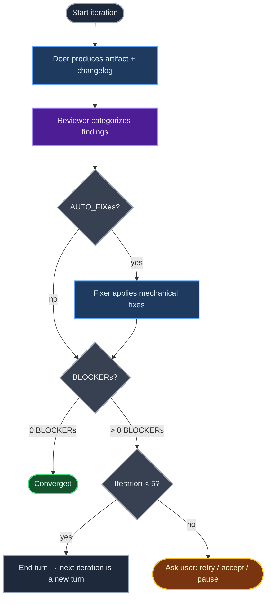

# doer

**Ticket execution orchestrator for Claude Code.** Version 2.2.0.

Takes a pre-defined ticket (feature, bug, refactor) from acceptance criteria to implementation-ready code on a feature branch. Nine sequential stages, delta-aware doer/reviewer loops, on-device runtime verification, automatic versioning + migrations.

Scope stops before PR and deploy.

---

## Installation

**One-time setup (per machine).** Clone once, symlink from every Claude config you use.

```bash
# 1. Clone the repo (one place only)
mkdir -p ~/src
git clone https://github.com/icarloscornejo/doer.git ~/src/doer

# 2. Symlink from each Claude config you use
ln -s ~/src/doer ~/.claude/skills/doer
ln -s ~/src/doer ~/.claude-work/skills/doer    # optional
ln -s ~/src/doer ~/.claude-me/skills/doer         # optional
# ...repeat for every .claude-* you have
```

**Updates:**

```bash
cd ~/src/doer && git pull
```

One pull refreshes every symlinked Claude. The Migration Check auto-applies any structural changes to in-flight tickets the next time they're touched.

---

## Usage

| Command | Description |
|---------|-------------|
| `/doer <TICKET-ID>` | Start a new ticket. Orchestrator asks for title, description, type, ACs, context, branch name. |
| `/doer continue <TICKET-ID>` | Resume a ticket from its last stage (across sessions). |
| `/doer status <TICKET-ID>` | Show current stage, loop state, blockers. |
| `/doer list` | List all tickets under `./.doer/tickets/`. |
| `/doer verify <TICKET-ID>` | Run stages that exist in the current skill but were missing when the ticket was closed. |
| `/doer cleanup-history <TICKET-ID>` | Strip any `.doer/` content from commits on the feature branch (auto-runs at wrapup). |

**No `/doer pause`.** State is persisted after every Agent return. To stop, just close the session or write `stop` / `wait` / `para`. To resume, `/doer continue <TICKET-ID>` from any future session.

**Implicit activation.** Once a ticket is active, natural language works too: "ok", "sí", "continue", "the plan looks good". Anything non-halt = continue. Halt signals (`stop`, `wait`, `para`) stop the orchestrator.

**Stages cannot be skipped manually.** Every stage must run. The only way to skip is via Stage 1's pre-existing-work detection.

---

## Pipeline (9 stages)



**Blue** = doer/reviewer loop (max 5 iterations) · **Amber** = validation gate · **Purple** = on-device runtime verification with temporary debug logs · **Green** = wrapup (lessons + performance) · **Slate** = single-pass stage

Stages with code (3, 4, 5, 7, 8) commit on the feature branch. Stages whose only output is in `.doer/` (1, 2, 9) skip the commit — `.doer/` is gitignored locally and never reaches the team.

---

## Pre-Existing Work

If you already started on the ticket (plan, tests, code, docs), Stage 1 detects it and skips ahead. The orchestrator **reads your commits, classifies touched files, and runs the test suite** to infer where you are — not just counts commits.



---

## Doer / Reviewer Loop

Stages 2, 3, 4, and 5 run a delta-aware convergence loop. **One full iteration runs in a single turn** (doer + reviewer + AUTO_FIX pass if needed) — works identically in CLI and IDE plugins.



**Iteration 1** — reviewer is clean-slate.
**Iteration 2+** — reviewer receives prior findings + doer's changelog. Marks each prior BLOCKER as `RESOLVED` or `STILL_OPEN`. Scans only the areas the doer touched for new issues.

### Findings (4 buckets)

| Bucket | Behavior | Examples |
|--------|----------|----------|
| `BLOCKER` | Loop continues until resolved | Failing test, missing AC coverage, security issue, broken build |
| `AUTO_FIX` | Applied automatically same iteration before convergence check | Reference to deleted function, unused import, test name stale after rename, typo |
| `SUGGESTION` | Logged to review file, never applied, never blocks | "Consider extracting", "could use map instead", design tweaks |
| `INFO` | Observational only | "This file is 500 LOC", "pattern used in 3 places" |

The decision rule for AUTO_FIX vs SUGGESTION: *"Is there anything to decide?"* No → AUTO_FIX. Yes → SUGGESTION. When in doubt → SUGGESTION (conservative — AUTO_FIX runs without asking).

---

## State Layout

**Lessons are GLOBAL** — they live next to `SKILL.md`, shared across every project that uses doer. **Assumptions are per-ticket.**

```
<doer-skill-dir>/                  # ~/src/doer/ (resolve symlinks)
├── SKILL.md
├── preferences.md                 # local config (gitignored, optional)
└── lessons/                       # GLOBAL — cross-project, gitignored
    └── {slug}.md

./.doer/                           # per-repo (in CWD), auto-added to .git/info/exclude
├── knowledge/
│   └── assumptions/
│       └── {TICKET-ID}.md
└── tickets/
    └── {TICKET-ID}/
        ├── metadata.json          # workflow state + raw intake (no separate ticket.md)
        ├── ac.md                  # confirmed ACs (Stage 1)
        ├── plan.md                # implementation plan (Stage 2) — compact tables
        ├── changelog.md           # doer's "what + why" log (compact bullets)
        ├── wrapup.md              # lessons + assumptions + performance (Stage 9)
        └── review/
            ├── plan-review.md     # ONE file per stage, sections per iteration
            ├── tests-review.md
            └── code-review.md
```

**Per ticket: ~6 files at completion.** No more `ticket.md`, `reflect.md`, `runtime-logs-added.md`, `runtime-log-output.txt`, `performance.md`, or per-iteration review files. Most artifacts consolidated or dropped as low-value in 2.0.0.

---

## `.doer/` Never Reaches the Team

A hard rule. The Workspace Guard runs at every entry point and ensures:

1. `.doer/` is in `.git/info/exclude` (per-clone, never committed).
2. The `.doer/` exclusion takes effect (test file under `.doer/` does not appear in `git status`).
3. Stale per-repo lessons are migrated to the global pool.
4. The Migration Check auto-upgrades the ticket to the current skill version.
5. Stage 9 wrapup runs `git filter-branch` to strip any `.doer/` content from prior commits on the feature branch (auto-confirmed once per ticket).

The team sees ONLY real code commits. No doer artifacts, no metadata, no review files.

---

## Locale (optional)

By default the orchestrator narrates in English. To override, create a `preferences.md` next to `SKILL.md`:

```yaml
locale: es
```

This is gitignored — never reaches GitHub. The orchestrator reads it as the **first action** of every invocation and narrates everything in that locale, overriding any other source. The first user-facing word is always in the operating locale (anchors against drift).

---

## Versioning & Auto-Migration

The skill follows SemVer (MAJOR.MINOR.PATCH). Every ticket persists `skill_version` in its metadata. On every entry point (`continue`, `verify`, any stage execution), the **Migration Check** auto-applies any pending migration silently:

| Bump | When | Migration block |
|------|------|------------------|
| MAJOR | Renames/removes stages, changes metadata shape, removes/renames artifact files | REQUIRED |
| MINOR | Adds capability OR changes the format of persistent files | REQUIRED if any persistent file format changed |
| PATCH | Bug fix to orchestrator behavior, no file format change | None |

If a bump changes the shape of a persistent file, a migration block is registered. Tickets in flight are auto-upgraded the next time they're touched. The dev never has to migrate by hand.

Current version: **2.2.0** (see SKILL.md frontmatter).

---

## Design Notes

- **One branch, one ticket.** All work lands on a single feature branch. Stages with real code commit; stages with only `.doer/` artifacts skip.
- **All commits use `git commit --no-verify`.** The orchestrator runs in developer mode — pre-commit hooks interrupt mid-stage. The dev runs the real checks manually before opening the PR.
- **Orchestrator is the sole voice.** Subagents write artifacts and return JSON summaries. Only the orchestrator prompts the user.
- **Iteration as a turn.** A full doer/reviewer iteration (incl. AUTO_FIX) runs in a single turn. Works identically in CLI and IDE plugins.
- **No hidden state.** Everything is on disk in `./.doer/`. Context compression cannot lose progress; closing the session = pausing.
- **No push, no PR, no deploy.** `/doer` stops after wrapup. You push and open the PR manually after running your project's pre-commit checks (lint, format, full tests) and squashing/reordering commits as desired.

---

## License

MIT
