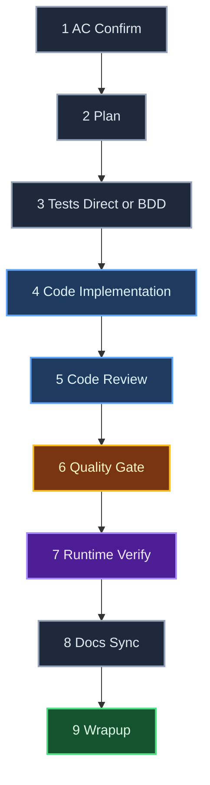

# Doer Work Kit (`wk`)

**Ticket execution orchestrator for Claude Code.** Plugin version 6.3.1.

Takes a pre-defined ticket (feature, bug, refactor) from acceptance criteria to implementation-ready code on a feature branch. Nine sequential stages, delta-aware doer/reviewer loops on the heaviest stages, on-device runtime verification, automatic versioning + migrations.

Scope stops before PR and deploy. Anything upstream (PRD, architecture, ticket creation) or downstream (PR assembly, CI, deploy) is out of scope by design.

---

## Install via marketplace

Detailed install ritual (and onboarding for a Claude session that just received this repo) lives in [`AGENTS.md`](./AGENTS.md). Quick version:

```bash
claude plugin marketplace add https://github.com/icarloscornejo/doer.git
claude plugin install wk@wk
claude plugin list
```

The plugin ships five operational skills (see "Included skills" below). After install, set your locale with `/wk:doer locale es` (or any ISO 639-1 code). The setting persists at `${CLAUDE_CONFIG_DIR:-$HOME/.claude}/wk/preferences.json` and survives plugin upgrades.

**Updates** (uninstall + reinstall is the working flow; `claude plugin update wk` is broken upstream):

```bash
claude plugin marketplace update wk
claude plugin uninstall wk
claude plugin install wk@wk
# restart Claude Code so the new version loads
```

The Migration Check auto-applies any structural changes to in-flight tickets the next time they're touched. Locale and opt-in flags live outside the versioned plugin cache (since 6.2.0), so they survive upgrades.

---

## Included skills

| Slash command | Status | Purpose |
|---------------|--------|---------|
| `/wk:doer ABC-123` | **Operational** | 9-stage ticket execution orchestrator (the core skill, was previously `/doer`). |
| `/wk:load <ID>` | **Operational** | Import a ticket from Jira / Linear / GitHub Issues into the doer intake. |
| `/wk:advise` | **Operational** | Review specs, ACs, or code with configurable advisor personas. |
| `/wk:review` | **Operational** | Review external pull requests with configurable advisor personas. |
| `/wk:publish ABC-123` | **Operational** | Push the feature branch and create a PR (GitHub) or MR (GitLab) for a completed ticket. Optional `--transition <state>` triggers a Jira state change. |

All 4 satellite skills shipped in 6.0.0 via `WK-7` through `WK-10` and are operational. See [`CHANGELOG.md`](./CHANGELOG.md) for per-version detail.

---

## Usage

### Day-to-day commands

| Command | Description |
|---------|-------------|
| `/wk:doer <TICKET-ID>` | Start a new ticket. Orchestrator asks for title, description, ACs, context, branch name, prior-work flags, then asks you to confirm the inferred testing strategy (`direct` or `bdd`). |
| `/wk:doer continue <TICKET-ID>` | Resume a ticket from its last stage (across sessions). |
| `/wk:doer status <TICKET-ID>` | Show current stage, loop state, blockers. |
| `/wk:doer list` | List all tickets under `./.doer/tickets/`. |

### Escape-hatch commands (rarely needed; flows below run automatically)

| Command | When to use it manually |
|---------|--------------------------|
| `/wk:doer verify <TICKET-ID>` | Only for tickets already at `status: complete`. The Migration Check auto-upgrades any in-flight ticket, but a closed ticket has no entry point, so this command is the only way to retroactively run new stages added to the skill after the ticket closed. |
| `/wk:doer cleanup-history <TICKET-ID>` | Auto-runs at wrapup (Stage 9). Use manually only if you declined the prompt at wrapup, want to preview/re-run the cleanup, or are working on a closed ticket. |

### Stopping and resuming

State is persisted to `metadata.json` after every Agent return; no separate "save" or "pause" needed. Multiple ways to stop:

| Action | When to use |
|--------|-------------|
| Close the session / quit Claude | End-of-day. Session exit doesn't lose anything; resume next day. |
| Write `stop`, `wait`, `hold on` | At any turn boundary. Orchestrator narrates where it stopped and stops. |
| Press `Esc` | Mid-Agent (the orchestrator is waiting for a subagent). Cancels the current Agent call. Works in CLI clients that support it. |
| `Ctrl+C` in the parent shell | Mid-Agent in terminal-based clients (e.g. Android Studio terminal) where `Esc` doesn't propagate. |

To resume from any future session: `/wk:doer continue <TICKET-ID>`.

### Talking to an active ticket

Once a ticket is active, natural language works alongside slash commands. Whatever you type at a turn boundary is interpreted as one of two intents:

| You write... | Orchestrator does |
|---|---|
| Anything non-halt (`ok`, `yes`, `continue`, `the plan looks good`, an unrelated question, even an empty message) | **Continue**: reads `metadata.json` and runs the next pending action |
| A halt signal (`stop`, `wait`, `hold on`) | **Stop**: narrates current position and exits |

You don't need to type `/wk:doer continue` to nudge the next iteration. That command is only for resuming **across sessions**.

---

## Testing strategy (Direct / BDD)

The orchestrator infers a testing strategy at intake from signals in the title, description, and raw ACs.

| Strategy | When | Stage 3 behavior |
|---|---|---|
| Direct | Cosmetic/trivial change (label rename, copy fix, constant change, no AC) | DEFERRED: Stage 4 runs first, regression tests written after Stage 4. Tests expected to PASS. No red phase. |
| BDD | User-facing behavior, observable bug, analytics with AC, flow with multiple states | Given/When/Then scenario tests first (failing); Stage 4 implements code derived from scenario names. |

Intake presents the inferred strategy and asks you to confirm or override:

```
Y                              accept as inferred
change strategy:bdd            override testing strategy to bdd
change strategy:direct         override testing strategy to direct
```

`testing_strategy` is set ONCE at intake and never changes mid-ticket. Pre-existing tickets that were created with `testing_strategy.mode = "tdd"` are auto-rewritten to `"bdd"` under v5.0.0 (the red-phase contract has the same shape).

---

## Pipeline (9 stages)



Color legend:

- **Blue**: doer/reviewer loop (Stages 4 and 5; max 3 iterations)
- **Amber**: validation gate (test suite execution)
- **Purple**: on-device runtime verification with temporary debug logs (always asks the dev; never silent skip)
- **Green**: wrapup (lessons + performance)
- **Slate**: single-pass stage (Stages 1, 2, 3, 8). Stages 2 and 3 use deterministic checks plus one retry on check failure

Stages with real-code commits (3, 4, 5, 7, 8) commit on the feature branch. Stages whose only output is `metadata.json` (1, 2, 9) skip the commit, since `metadata.json` is gitignored locally and never reaches the team.

---

## Pre-Existing Work

If you already started on the ticket (plan, tests, code, docs), Stage 1 detects it and skips ahead. The orchestrator reads your commits, classifies touched files, and runs the test suite, then asks you to confirm the inferred entry point.

| You have... | Entry stage |
|---|---|
| Nothing | 1 (AC confirm) |
| Plan only | 3 (tests) |
| Plan + tests | 4 (code) |
| Plan + tests + partial code | 4 (code) |
| Plan + tests + complete code | 5 (code review) |

Skipped stages are marked `imported` in `metadata.json`; uncommitted changes get a baseline commit before resuming.

---

## Doer / Reviewer Loop

Stages 4 (Code) and 5 (Code Review) only. Max 3 iterations. One full iteration (doer + reviewer + AUTO_FIX pass) runs in a single turn. Iteration 1 is clean-slate; iteration 2+ is a combined fixer-reviewer agent that receives prior findings inline and only re-scans the areas the doer touched.

Stages 2 (Plan) and 3 (Tests) do NOT loop. Single-pass, then deterministic checks decide pass/fail. On check failure the writer agent is invoked once more with the BLOCKERs inline; a second failure marks the stage `blocked` and the dev fixes manually before `/wk:doer continue`.

### Findings (4 buckets)

| Bucket | Behavior | Examples |
|--------|----------|----------|
| `BLOCKER` | Loop continues until resolved | Failing test, missing AC coverage, security issue, broken build |
| `AUTO_FIX` | Applied automatically same iteration before convergence check | Reference to deleted function, unused import, stale test name, typo |
| `SUGGESTION` | Logged to `metadata.code_review`, never applied, never blocks | "Consider extracting", design tweaks |
| `INFO` | Observational only | "This file is 500 LOC", "pattern used in 3 places" |

Decision rule for AUTO_FIX vs SUGGESTION: *"Is there anything to decide?"* No → AUTO_FIX. Yes → SUGGESTION. When in doubt → SUGGESTION.

---

## State Layout

State is split between the **plugin install** (cross-project) and **per-repo `.doer/`** (one directory per checkout). Per-ticket state lives in a single `metadata.json`; no markdown sidecars.

```
${CLAUDE_PLUGIN_ROOT}/             # plugin install, e.g. ~/.claude/plugins/cache/wk/
├── skills/{doer,load,advise,review,publish}/SKILL.md
├── lib/                           # protocols + helpers (see AGENTS.md for the tree)
│   ├── memory-paths.md            # source of truth for metadata.json schema
│   ├── helpers/*.sh               # bash helpers (lock, inbox, cost, preferences)
│   └── advisor-personas/*.json    # 5 personas: security, performance, mobile, accessibility, api
└── lessons/{slug}.md              # GLOBAL, cross-project

${CLAUDE_CONFIG_DIR:-$HOME/.claude}/wk/
└── preferences.json               # locale + opt-in flags. Outside the versioned plugin cache.

./.doer/                           # per-repo (in CWD), auto-added to .git/info/exclude
└── tickets/{TICKET-ID}/
    ├── metadata.json              # SINGLE source of truth per ticket
    ├── lock.json                  # per-ticket lock
    └── advisor-findings/{persona-id}.json   # only when /wk:advise --target ticket:<ID> ran
```

Lessons are GLOBAL across every repo that uses the plugin. Sub-agents receive the relevant slices of metadata inlined in their prompts; they do not read sidecar files.

The full `metadata.json` schema (top-level fields, owners, per-stage runtime fields) lives in [`lib/memory-paths.md`](./lib/memory-paths.md).

---

## `.doer/` Never Reaches the Team

A hard rule. The Workspace Guard runs at every entry point and ensures:

1. `.doer/` is in `.git/info/exclude` (per-clone, never committed).
2. The `.doer/` exclusion takes effect (test file under `.doer/` does not appear in `git status`).
3. Stale per-repo lessons are migrated to the global pool.
4. The Migration Check auto-upgrades the ticket to the current skill version.
5. Stage 9 wrapup runs `git filter-branch` to strip any `.doer/` content from prior commits on the feature branch (only when needed; typically a no-op for tickets created with the Workspace Guard active from the start).

**`.doer/` files always remain on disk.** The cleanup at wrapup only rewrites git history; it never touches the filesystem.

After a ticket completes you can still:

- Run `/wk:doer status <TICKET-ID>` for a summary
- Run `/wk:doer list` to see all tickets
- Run `/wk:doer continue <TICKET-ID>` to inspect or extend
- Read `./.doer/tickets/<TICKET-ID>/metadata.json` directly for ac, plan, changelog, code review history, wrapup summary, and performance stats

The team sees ONLY real code commits. No doer artifacts, no metadata, no review history.

---

## Locale (optional)

The orchestrator narrates in English by default. Override the locale globally per Claude Code config:

```bash
/wk:doer locale es     # any ISO 639-1 code; es, fr, en, ...
```

This writes to `${CLAUDE_CONFIG_DIR:-$HOME/.claude}/wk/preferences.json` (outside the versioned plugin cache, so it survives plugin upgrades). On the first message of a session with no locale set, the orchestrator runs a one-shot heuristic and asks once in Spanish if it detects Spanish keyword density.

| Scope | Language |
|---|---|
| Live chat (narration, questions, confirmations) | Operating locale |
| Persistent state on disk (metadata, lessons, commit messages) | **Always English** |

Persistent state stays in English so the global lessons pool is shareable across projects and future tickets, regardless of which language the dev is working in.

---

## Opt-in features (preferences.json)

Toggles live in the global preferences file at `${CLAUDE_CONFIG_DIR:-$HOME/.claude}/wk/preferences.json`. Most default off; `stage1_ac_self_review` defaults on because it adds dev confidence at near-zero cost.

| Key | Default | Summary |
|---|---|---|
| `stage1_ac_self_review` | `true` | Stage 1 dispatches an `ac-reviewer` sub-agent that compares the AC draft against intake. Findings (`affirmation` / `gap` / `blocker`) surface to the dev; blockers promote to Open Questions. Never auto-applies fixes. Non-fatal on failure. |
| `stage4_per_task_gate` | `false` | Stage 4 implements one plan step at a time and pauses for `[a]ccept / [e]dit / [r]eject / [s]kip` after each. Mutually exclusive with `stage4_parallel_subagents`. |
| `stage4_parallel_subagents` | `false` | Stage 4 groups disjoint plan steps and dispatches them as parallel Agent calls. Serializes on file overlap. |
| `stage5_advisor_personas` | `[]` | Stage 5 dispatches the listed advisor personas (e.g. `["security","performance"]`) via `/wk:advise` once at iter 1. Findings flow into the standard reviewer buckets with `source: "advisor:<persona-id>"`. 5 personas shipped: `security`, `performance`, `mobile`, `accessibility`, `api`. |

Example `preferences.json`:

```json
{
  "locale": "es",
  "stage1_ac_self_review": true,
  "stage4_parallel_subagents": true,
  "stage5_advisor_personas": ["security"]
}
```

Set individual flags via the helper:

```bash
"${CLAUDE_PLUGIN_ROOT}/lib/helpers/preferences.sh" set-flag stage4_parallel_subagents true
```

Per-flag protocols live in `skills/doer/SKILL.md` and the relevant stage file.

---

## Versioning & Auto-Migration

The skill follows SemVer (MAJOR.MINOR.PATCH). Every ticket persists `skill_version` in its metadata. On every entry point (`continue`, `verify`, any stage execution), the **Migration Check** auto-applies any pending migration silently:

| Bump | When | Migration block |
|------|------|------------------|
| MAJOR | Renames/removes stages, changes the shape of `metadata.json`, removes/renames artifact files | REQUIRED |
| MINOR | Adds capability OR changes the shape of any persistent field | REQUIRED if any persistent format changed |
| PATCH | Bug fix to orchestrator behavior, no format change | None |

If a bump changes the shape of any persistent field, a migration block is registered. Tickets in flight are auto-upgraded the next time they're touched. The dev never has to migrate by hand.

The migration also runs Phase 2 auto-reverify: spot-checks completed stages whose `verified_with` is older than the current SKILL version.

- **In-flight tickets**: spot-checks fire automatically before resume.
- **Closed tickets**: the orchestrator asks once whether to reverify.

**Current version: 6.3.1.** All migrations are idempotent and run automatically the next time any in-flight ticket is touched. See [`CHANGELOG.md`](./CHANGELOG.md) for per-version detail.

---

## Design Notes

- **One branch, one ticket.** Stages with real code commit; stages with only `.doer/` artifacts skip.
- **All commits use `--no-verify`.** Pre-commit hooks would interrupt mid-stage. The dev runs the real checks manually before the PR.
- **Orchestrator is the sole voice.** Subagents write artifacts and return JSON summaries; only the orchestrator prompts the user.
- **Iteration as a turn.** A full doer/reviewer iteration runs in a single turn. Works identically in CLI and IDE plugins.
- **No hidden state.** Everything lives on disk in `./.doer/`. Context compression cannot lose progress; closing the session = pausing.
- **Anti-compaction.** A heartbeat self-check at every stage transition forces re-hydration (locale, SKILL section, metadata) if compaction dropped them from context.
- **No push, no PR, no deploy.** `/wk:doer` stops after wrapup. Push manually or run `/wk:publish <TICKET-ID>` to push the branch, build the PR/MR body from metadata, and optionally transition the linked Jira ticket.

---

## License

MIT
