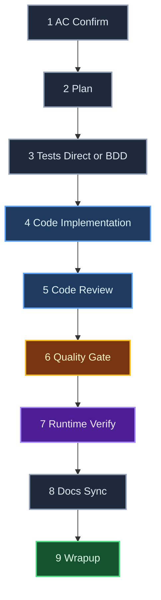
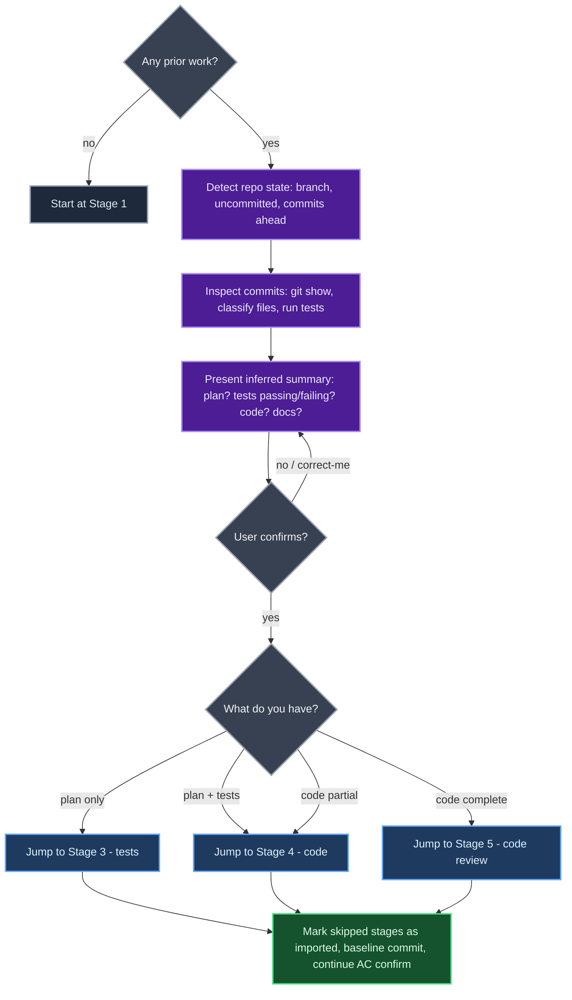

# Doer Work Kit (`wk`)

**Ticket execution orchestrator for Claude Code.** Plugin version 6.0.0.

Takes a pre-defined ticket (feature, bug, refactor) from acceptance criteria to implementation-ready code on a feature branch. Nine sequential stages, delta-aware doer/reviewer loops on the heaviest stages, on-device runtime verification, automatic versioning + migrations.

Scope stops before PR and deploy. Anything upstream (PRD, architecture, ticket creation) or downstream (PR assembly, CI, deploy) is out of scope by design.

---

## Install via marketplace

Detailed install ritual (and onboarding for a Claude session that just received this repo) lives in [`AGENTS.md`](./AGENTS.md). Quick version:

```bash
claude plugin marketplace add https://github.com/icarloscornejo/doer.git
claude plugin install wk@wk
claude plugin list
```

The plugin ships five skills (one operational, four placeholders, see "Included skills" below). After install, edit `preferences.md` in the cached plugin dir to set your locale.

**Updates:**

```bash
claude plugin marketplace update wk
```

The Migration Check auto-applies any structural changes to in-flight tickets the next time they're touched.

---

## Included skills

| Slash command | Status | Purpose |
|---------------|--------|---------|
| `/wk:doer ABC-123` | **Operational** | 9-stage ticket execution orchestrator (the core skill, was previously `/doer`). |
| `/wk:load <ID>` | **Operational** | Import a ticket from Jira / Linear / GitHub Issues into the doer intake. |
| `/wk:advise` | **Operational** | Review specs, ACs, or code with configurable advisor personas. |
| `/wk:review` | Placeholder (WK-9) | Review external pull requests with configurable advisor personas. |
| `/wk:publish ABC-123` | Placeholder (WK-10) | Create a merge request and transition the Jira ticket. Opt-in. |

Satellite skills land progressively in 6.0.0 via `WK-7` through `WK-10`. `/wk:load` and `/wk:advise` are operational; `review`, `publish` are placeholders until their tickets ship. See [`ROADMAP.md`](./ROADMAP.md) for the full roadmap.

**Backward compat:** the legacy `/doer ABC-123` invocation still works. The orchestrator detects the migrated skill and routes to `/wk:doer`.

---

## Usage

### Day-to-day commands

| Command | Description |
|---------|-------------|
| `/wk:doer <TICKET-ID>` | Start a new ticket. Orchestrator asks for title, description, ACs, context, branch name, prior-work flags, then asks you to confirm the inferred testing strategy (`direct` or `bdd`). |
| `/wk:doer continue <TICKET-ID>` | Resume a ticket from its last stage (across sessions). |
| `/wk:doer status <TICKET-ID>` | Show current stage, loop state, blockers. |
| `/wk:doer list` | List all tickets under `./.doer/tickets/`. |

### Escape-hatch commands (rarely needed; flows below run automatically)

| Command | When to use it manually |
|---------|--------------------------|
| `/wk:doer verify <TICKET-ID>` | Only for tickets already at `status: complete`. The Migration Check auto-upgrades any in-flight ticket, but a closed ticket has no entry point, so this command is the only way to retroactively run new stages added to the skill after the ticket closed. |
| `/wk:doer cleanup-history <TICKET-ID>` | Auto-runs at wrapup (Stage 9). Use manually only if you declined the prompt at wrapup, want to preview/re-run the cleanup, or are working on a closed ticket. |

### Stopping and resuming

State is persisted to `metadata.json` after every Agent return; no separate "save" or "pause" needed. Multiple ways to stop:

| Action | When to use |
|--------|-------------|
| Close the session / quit Claude | End-of-day. Session exit doesn't lose anything; resume next day. |
| Write `stop`, `wait`, `hold on` | At any turn boundary. Orchestrator narrates where it stopped and stops. |
| Press `Esc` | Mid-Agent (the orchestrator is waiting for a subagent). Cancels the current Agent call. Works in CLI clients that support it. |
| `Ctrl+C` in the parent shell | Mid-Agent in terminal-based clients (e.g. Android Studio terminal) where `Esc` doesn't propagate. |

To resume from any future session: `/wk:doer continue <TICKET-ID>`.

### Talking to an active ticket

Once a ticket is active, natural language works alongside slash commands. Whatever you type at a turn boundary is interpreted as one of two intents:

| You write... | Orchestrator does |
|---|---|
| Anything non-halt (`ok`, `yes`, `continue`, `the plan looks good`, an unrelated question, even an empty message) | **Continue**: reads `metadata.json` and runs the next pending action |
| A halt signal (`stop`, `wait`, `hold on`) | **Stop**: narrates current position and exits |

You don't need to type `/wk:doer continue` to nudge the next iteration. That command is only for resuming **across sessions**.

---

## Testing strategy (Direct / BDD)

The orchestrator infers a testing strategy at intake from signals in the title, description, and raw ACs.

| Strategy | When | Stage 3 behavior |
|---|---|---|
| Direct | Cosmetic/trivial change (label rename, copy fix, constant change, no AC) | DEFERRED: Stage 4 runs first, regression tests written after Stage 4. Tests expected to PASS. No red phase. |
| BDD | User-facing behavior, observable bug, analytics with AC, flow with multiple states | Given/When/Then scenario tests first (failing); Stage 4 implements code derived from scenario names. |

Intake presents the inferred strategy and asks you to confirm or override:

```
Y                              accept as inferred
change strategy:bdd            override testing strategy to bdd
change strategy:direct         override testing strategy to direct
```

`testing_strategy` is set ONCE at intake and never changes mid-ticket. Pre-existing tickets that were created with `testing_strategy.mode = "tdd"` are auto-rewritten to `"bdd"` under v5.0.0 (the red-phase contract has the same shape).

---

## Pipeline (9 stages)



Color legend:

- **Blue**: doer/reviewer loop (Stages 4 and 5; max 3 iterations)
- **Amber**: validation gate (test suite execution)
- **Purple**: on-device runtime verification with temporary debug logs (always asks the dev; never silent skip)
- **Green**: wrapup (lessons + performance)
- **Slate**: single-pass stage (Stages 1, 2, 3, 8). Stages 2 and 3 use deterministic checks plus one retry on check failure

Stages with real-code commits (3, 4, 5, 7, 8) commit on the feature branch. Stages whose only output is `metadata.json` (1, 2, 9) skip the commit, since `metadata.json` is gitignored locally and never reaches the team.

---

## Pre-Existing Work

If you already started on the ticket (plan, tests, code, docs), Stage 1 detects it and skips ahead. The orchestrator **reads your commits, classifies touched files, and runs the test suite** to infer where you are, not just count commits.



---

## Doer / Reviewer Loop

**Stages 4 (Code) and 5 (Code Review) only.** Max 3 iterations. **One full iteration runs in a single turn** (doer + reviewer + AUTO_FIX pass if needed). Works identically in CLI and IDE plugins.

Stages 2 (Plan) and 3 (Tests) do NOT loop. They run single-pass, then deterministic checks decide pass/fail. On check failure, the writer agent is invoked **once more** with the BLOCKERs inline. A second failure aborts the stage with `status: "blocked"`; the dev fixes manually and reruns `/wk:doer continue` (the orchestrator re-runs only the deterministic checks, no new agent invocation).


**Iteration 1**: reviewer is clean-slate (gets `metadata.ac`, `metadata.plan`, the diff, the last `metadata.changelog` entries inline).
**Iteration 2+**: ONE combined fixer-reviewer agent. Receives prior findings + last `metadata.code_review` entry + doer's last changelog appendices, all inline. Marks each prior BLOCKER as `RESOLVED` or `STILL_OPEN`. Scans only the areas the doer touched for new issues.

### Findings (4 buckets)

| Bucket | Behavior | Examples |
|--------|----------|----------|
| `BLOCKER` | Loop continues until resolved | Failing test, missing AC coverage, security issue, broken build |
| `AUTO_FIX` | Applied automatically same iteration before convergence check | Reference to deleted function, unused import, test name stale after rename, typo |
| `SUGGESTION` | Logged to `metadata.code_review`, never applied, never blocks | "Consider extracting", "could use map instead", design tweaks |
| `INFO` | Observational only | "This file is 500 LOC", "pattern used in 3 places" |

The decision rule for AUTO_FIX vs SUGGESTION: *"Is there anything to decide?"* No → AUTO_FIX. Yes → SUGGESTION. When in doubt → SUGGESTION (conservative; AUTO_FIX runs without asking).

---

## State Layout

**Lessons are GLOBAL**: they live next to `SKILL.md`, shared across every project that uses doer. **Everything per-ticket lives in a single `metadata.json`** (no markdown sidecars, no scratch files, no per-stage review files; v3.0.0 consolidated all of that into structured fields).

```
<doer-skill-dir>/                  # ~/src/doer/ (resolve symlinks)
├── SKILL.md
├── preferences.md                 # local config (gitignored, optional)
└── lessons/                       # GLOBAL, cross-project, gitignored
    └── {slug}.md

./.doer/                           # per-repo (in CWD), auto-added to .git/info/exclude
├── knowledge/                     # reserved for future cross-ticket data; empty by default
└── tickets/
    └── {TICKET-ID}/
        └── metadata.json          # SINGLE file: state + intake + ac + plan + changelog + code_review + assumptions_validation + lessons_captured + summary + performance
```

**Per ticket: 1 file (`metadata.json`).** Top-level fields cover the full ticket lifecycle:

| Field | Owner | Notes |
|---|---|---|
| `testing_strategy` | Intake (heuristic + dev confirm) | `direct` or `bdd`. Set ONCE; never changes mid-ticket |
| `intake` | Intake | Raw description, ACs as pasted, context, prior-work flags |
| `ac` | Stage 1 | Structured: `in_scope[]`, `out_of_scope[]`, `open_questions_resolved[]`, `applicable_lessons[]` |
| `plan` | Stage 2 | Structured: `files[]`, `steps[]`, `tests[]`, `risks[]`, `assumptions[]` |
| `changelog` | Every doer stage appends | Append-only array of `{stage, iteration, kind, items[]}` |
| `code_review` | Stage 5 appends | Append-only array of `{iteration, blockers, auto_fixes, suggestions, info, verdict}` |
| `assumptions_validation` | Stage 9 | Each plan assumption marked VALIDATED / INVALIDATED / UNVERIFIED |
| `lessons_captured` | Stage 9 | Refs to global lessons added during this ticket |
| `summary` | Stage 9 | One-paragraph wrapup |
| `performance` | Stage 9 | Timing, agent invocation counts, convergence stats, reviewer ROI |
| `stages.<N>.{status, verified_with, ...}` | State machine | Per-stage status + stage-specific runtime fields (`retry_used` for 2/3, `iterations`/`loop_outcome` for 4/5, `ac_verdicts` for 7) |

Sub-agents receive the relevant slices of metadata **inlined in their prompts**; they do not read sidecar files.

What got consolidated into `metadata.json` in v3.0.0 (and no longer exists as a file):

- `context.md`
- `ac.md`
- `plan.md`
- `changelog.md`
- `wrapup.md`
- The `review/` directory

The consolidation eliminates drift between sidecar files, file-coordination cost across stages, and re-read overhead in subagent loops.

**Migrating from v2.10.0:**

- The first `/wk:doer <ID>` after upgrade auto-runs the migration block.
- LLM parser agents convert each old `.md` file into its corresponding metadata field, then delete the file.

---

## `.doer/` Never Reaches the Team

A hard rule. The Workspace Guard runs at every entry point and ensures:

1. `.doer/` is in `.git/info/exclude` (per-clone, never committed).
2. The `.doer/` exclusion takes effect (test file under `.doer/` does not appear in `git status`).
3. Stale per-repo lessons are migrated to the global pool.
4. The Migration Check auto-upgrades the ticket to the current skill version.
5. Stage 9 wrapup runs `git filter-branch` to strip any `.doer/` content from prior commits on the feature branch (only when needed; typically a no-op for tickets created with the Workspace Guard active from the start).

**`.doer/` files always remain on disk.** The cleanup at wrapup only rewrites git history; it never touches the filesystem.

After a ticket completes you can still:

- Run `/wk:doer status <TICKET-ID>` for a summary
- Run `/wk:doer list` to see all tickets
- Run `/wk:doer continue <TICKET-ID>` to inspect or extend
- Read `./.doer/tickets/<TICKET-ID>/metadata.json` directly for ac, plan, changelog, code review history, wrapup summary, and performance stats

The team sees ONLY real code commits. No doer artifacts, no metadata, no review history.

---

## Locale (optional)

By default the orchestrator narrates in English. To override, create a `preferences.md` next to `SKILL.md` with any ISO 639-1 language code:

```yaml
locale: es    # Spanish
# locale: fr    # French
# locale: pt    # Portuguese
# locale: de    # German
# locale: it    # Italian
# locale: ja    # Japanese
# locale: zh    # Chinese
# locale: ko    # Korean
# locale: ru    # Russian
# locale: ar    # Arabic
# locale: hi    # Hindi
# locale: nl    # Dutch
# locale: pl    # Polish
# locale: tr    # Turkish
# locale: en    # English (the default; setting it explicitly is harmless)
```

This file is gitignored; never reaches GitHub. The orchestrator reads it as the **first action** of every invocation and narrates everything in that locale, overriding any other source.

**Scope of the locale override:**

| Scope | Language |
|-------|----------|
| Live chat (narration, questions, summaries, confirmations) | Operating locale (`es`, `fr`, etc.) |
| Persistent state on disk | **Always English** |

"Persistent state on disk" includes:

- Every string field in `metadata.json` (`summary`, `ac.in_scope`, `plan.steps`, `changelog[].items[].text`, `code_review[].blockers[].text`, etc.)
- Global lessons under `<doer-skill-dir>/lessons/`
- Every commit message

**Why English-only on disk:** the persisted state is read by other subagents and by future tickets across projects. A single language keeps the global lessons pool shareable and prevents cross-language confusion.

---

## Versioning & Auto-Migration

The skill follows SemVer (MAJOR.MINOR.PATCH). Every ticket persists `skill_version` in its metadata. On every entry point (`continue`, `verify`, any stage execution), the **Migration Check** auto-applies any pending migration silently:

| Bump | When | Migration block |
|------|------|------------------|
| MAJOR | Renames/removes stages, changes the shape of `metadata.json`, removes/renames artifact files | REQUIRED |
| MINOR | Adds capability OR changes the shape of any persistent field | REQUIRED if any persistent format changed |
| PATCH | Bug fix to orchestrator behavior, no format change | None |

If a bump changes the shape of any persistent field, a migration block is registered. Tickets in flight are auto-upgraded the next time they're touched. The dev never has to migrate by hand.

The migration also runs Phase 2 auto-reverify: spot-checks completed stages whose `verified_with` is older than the current SKILL version.

- **In-flight tickets**: spot-checks fire automatically before resume.
- **Closed tickets**: the orchestrator asks once whether to reverify.

**Current version: 6.0.0** (see SKILL.md frontmatter). The latest migration (5.0.0 → 6.0.0) restructures the install from a single skill into a formal Claude Code plugin with five skills, and ships the per-ticket lock protocol (WK-1).

---

## Design Notes

- **One branch, one ticket.** All work lands on a single feature branch. Stages with real code commit; stages with only `.doer/` artifacts skip.
- **All commits use `git commit --no-verify`.** The orchestrator runs in developer mode. Pre-commit hooks interrupt mid-stage. The dev runs the real checks manually before opening the PR.
- **Orchestrator is the sole voice.** Subagents write artifacts and return JSON summaries. Only the orchestrator prompts the user.
- **Iteration as a turn.** A full doer/reviewer iteration (incl. AUTO_FIX) runs in a single turn. Works identically in CLI and IDE plugins.
- **No hidden state.** Everything is on disk in `./.doer/`. Context compression cannot lose progress; closing the session = pausing.
- **Context continuity (anti-compaction).** Long Claude Code sessions get compacted to fit in context, which can drop SKILL.md rules from the orchestrator's working memory. The orchestrator runs a heartbeat self-check at every stage transition and every `/wk:doer continue`; if the heartbeat anchor is missing from context, it triggers forced re-hydration (re-read preferences, the relevant SKILL section, and metadata). Cost: zero in normal operation, paid only when compaction is detected.
- **No push, no PR, no deploy.** `/doer` stops after wrapup. You push and open the PR manually after running your project's pre-commit checks (lint, format, full tests) and squashing/reordering commits as desired.

---

## License

MIT
